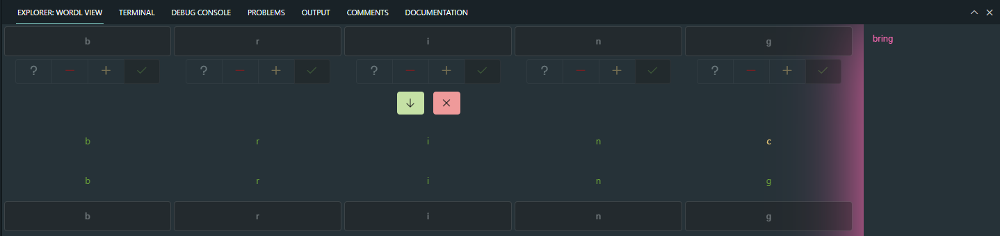

# Wordl view based on VSCode Webview

Assists in solving Wordl.


## Development

This project was generated with `Angular CLI`, so it can be be used for angular development by default.

To test this extension in vscode context:
```
$ yarn install
$ yarn run build
```

After build process you can press F5 to "Start Debugging" (or: select in menu "Debug" -> "Start Debugging"). A new window will open in which you need to open command palette (Ctrl/Cmd + Shift + P).

## Packaging

To generate extension in `VSIX` format execute the package command:

```
yarn run package
```

Finally the generated VSIX file with VSCode extension should appear in the root folder of your project.

# Acknowledgements

Project was inspired by:

https://github.com/4gray/vscode-webview-angular
